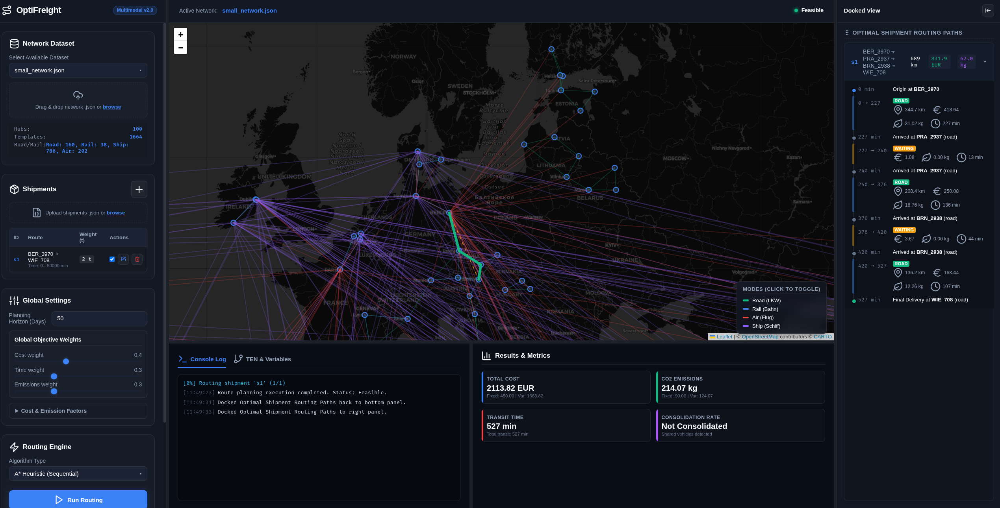

# Sustainable Freight Mode Choice

📄 **[Projekt-Dokumentation (PDF)](https://github.com/ProfReusch2026MOR/Sustainable_Freight_Mode_Choice/releases/download/v0.1.0/main.pdf)** (Lokal: [main.pdf](file:///home/benedikt/Projects/Sustainable_Freight_Mode_Choice/documentation/main.pdf)) | 📊 **[Präsentations-Folien (PDF)](https://github.com/ProfReusch2026MOR/Sustainable_Freight_Mode_Choice/releases/download/v0.1.0/first_pitch.pdf)** (Lokal: [first_pitch.pdf](file:///home/benedikt/Projects/Sustainable_Freight_Mode_Choice/presentations/first_pitch.pdf))

[](https://github.com/ProfReusch2026MOR/Sustainable_Freight_Mode_Choice/actions/workflows/ci.yml)

## Projektmitglieder

| Name | GitHub-Username |
|------|-----------------|
| Benedikt Wehner | [bennewehn](https://github.com/bennewehn) |
| Phil Kahlert | [phil-kl](https://github.com/phil-kl) |
| Laurens Rüther | [LaurensRuether](https://github.com/LaurensRuether) |
| Luis Kruse | [lkruse301](https://github.com/lkruse301) |
| Minglu Li (Sam) | [Sam18069272581](https://github.com/Sam18069272581) |

---

## Projektbeschreibung

Dieses Projekt beschäftigt sich mit der nachhaltigen Planung und Optimierung von Gütertransporten in einem multimodalen Transportnetzwerk. Ziel ist es, Sendungen effizient über verschiedene Verkehrsträger zu transportieren und dabei wirtschaftliche, zeitliche sowie ökologische Aspekte gleichzeitig zu berücksichtigen.

Im Mittelpunkt steht die Entwicklung eines Operations-Research-Modells zur Entscheidungsunterstützung in der Logistik.

Das Modell entscheidet:

- welche Transportwege genutzt werden  
- welche Verkehrsträger eingesetzt werden  
- wann intermodale Transporte sinnvoll sind  
- wann Transporte konsolidiert werden sollten  
- wie Lieferfristen trotz Kapazitätsrestriktionen eingehalten werden können  

Das Transportnetzwerk umfasst folgende Verkehrsträger:

- LKW (Straßentransport)
- Bahn (Schienentransport)
- Schiff (See- und Binnenschifffahrt)
- Flugzeug (Luftfracht)

Zusätzlich werden Umschlagterminals berücksichtigt, an denen ein Wechsel zwischen verschiedenen Verkehrsträgern stattfinden kann.

---

## Entscheidungsfrage

Im Mittelpunkt dieses Projekts steht die Frage, wie Gütertransporte in einem multimodalen Transportnetzwerk optimal geplant werden können. Unternehmen müssen täglich entscheiden, welche Verkehrsträger für bestimmte Sendungen eingesetzt werden sollen, um sowohl wirtschaftliche als auch ökologische Ziele zu erreichen. Dabei stehen verschiedene Transportmöglichkeiten wie LKW, Bahn, Schiff und Flugzeug zur Verfügung, die sich hinsichtlich Kosten, Lieferzeit, Kapazitäten und CO₂-Emissionen deutlich unterscheiden.

Die zentrale Entscheidungsfrage lautet daher:

#### "Wie können mehrere Sendungen in einem multimodalen Transportnetzwerk so geplant werden, dass Transportkosten und Emissionen minimiert werden, während Lieferfristen, Kapazitätsgrenzen und Umschlagsprozesse eingehalten werden?"

---

## Reale Motivation

Der weltweite Güterverkehr ist essenziell für globale Lieferketten und internationale Wirtschaftssysteme. Gleichzeitig verursacht der Transportsektor erhebliche Mengen an CO₂-Emissionen.

Typische Entscheidungen in der Praxis:

- Soll eine Sendung per Flugzeug transportiert werden?
- Ist Bahn ausreichend?
- Wann lohnt sich Schiffstransport?
- Welche Transporte können gebündelt werden?
- Wie lassen sich Emissionen reduzieren?

Typische Nutzung:

- LKW: regionale Zustellung  
- Bahn: Langstrecke  
- Schiff: internationale Transporte  
- Flugzeug: zeitkritische Lieferungen  

---

## Projektziele

### Fachliche Ziele

- Entwicklung eines Optimierungsmodells  
- Analyse multimodaler Transportentscheidungen  
- Untersuchung von Kosten-Emissions-Zielkonflikten  
- Bewertung intermodaler Strategien  
- Analyse von Konsolidierungseffekten  

### Methodische Ziele

- Vergleich exakter und heuristischer Verfahren  
- Untersuchung der Skalierbarkeit  
- Laufzeitanalyse  
- Bewertung der Lösungsqualität  

### Praktische Ziele

- Entwicklung realistischer Entscheidungshilfen  
- Ableitung logistischer Empfehlungen  
- Unterstützung nachhaltiger Transportplanung  

---

## Transportnetzwerk

### Bestandteile

- Städte  
- Häfen  
- Flughäfen  
- Bahnhöfe  
- Logistikzentren  
- Umschlagterminals  
- Intermodale Hubs  

### Verbindungen

- Straßenverbindungen  
- Bahnverbindungen  
- Schifffahrtsrouten  
- Flugrouten  

---

## Verkehrsträger

### LKW

- flexibel  
- hohe Emissionen  
- mittlere Kapazität  
- geeignet für First- & Last-Mile  

### Bahn

- kosteneffizient  
- geringe Emissionen  
- hohe Kapazität  
- längere Transportzeiten  

### Schiff

- sehr günstig  
- sehr hohe Kapazität  
- sehr langsam  
- ideal für internationale Transporte  

### Flugzeug

- sehr schnell  
- sehr teuer  
- hohe Emissionen  
- geringe Kapazität  

---

## Datenmodell

### Netzwerkdaten

- Knoten: Städte, Häfen, Flughäfen, Bahnhöfe, Terminals  
- Kanten: Transportverbindungen  

### Sendungsdaten

- Ursprung / Ziel  
- Gewicht / Volumen  
- Priorität  
- Deadline  

### Transportparameter

- Kosten  
- Zeiten  
- Emissionen  
- Kapazitäten  

### Terminaldaten

- Umschlagskosten  
- Transferzeiten  
- Kapazitäten  

---

## Instanzen

### Kleine Instanz

- Modellvalidierung  
- einfache Struktur  
- wenige Sendungen  

### Mittlere Instanz

- erste Optimierungseffekte  
- mehrere Terminals  
- mehr Sendungen  

### Große Instanz

- hohe Komplexität  
- viele Entscheidungen  
- realistische Netzwerke  

---

## Mathematisches Modell

### Entscheidungsvariablen

- **Routingvariable ($x_{a,k} \in \{0, 1\}$):** Gibt an, ob Sendung $k$ die zeitexpandierte Kante $a$ nutzt.
- **Kapazitätsvariable ($v_a \in \mathbb{N}_0$):** Bestimmt die Anzahl der aktivierten Kapazitäts-/Fahrzeugeinheiten auf Kante $a$.
- **Schlupfvariablen ($s_k^D, s_k^B, s_k^E \geq 0$):** Messen die Überschreitung weicher Restriktionen für Lieferfrist (Deadlines), Preisgrenzen (Budget) und Emissionsobergrenzen.

### Zielfunktion

Minimierung von $Z = Z^{\text{route}} + \rho Z^{\text{slack}}$:
- **Routingterm ($Z^{\text{route}}$):** Minimiert die gewichteten und normierten variablen Transportkosten, Fahrzeiten und CO₂-Emissionen für alle Sendungen sowie die anteiligen Fixkosten.
- **Strafterm ($Z^{\text{slack}}$):** Bestraft Verletzungen der weichen Restriktionen (Lieferzeiten, Budgetgrenzen, Emissionsgrenzen).

### Nebenbedingungen

- **Flusserhaltung:** Steuert den Transportfluss vom Start zum Ziel auf dem zeitexpandierten Graphen.
- **Kapazitäts- und Kopplungsbedingungen:** Sichert, dass das Gesamtgewicht aller Kanten-nutzenden Sendungen die Kantenkapazität der aktivierten Fahrzeuge nicht überschreitet.
- **Lieferfristen (Deadlines):** Garantiert die Einhaltung der maximal zulässigen Lieferzeit für jede Sendung (unterstützt durch weiche Restriktionen).
- **Budget- und Emissionsgrenzen:** Begrenzt die Kosten und Emissionen pro Sendung oder global (unterstützt durch weiche Restriktionen).

---

## Solver-Implementierung

Technologien:

- Python (Modellierung mit **PuLP**)
- Solver: **HiGHS** (über `highspy`), optional CBC

### Auswertung und Diagnose

- Optimierungs-Laufzeit (CPU-Time)
- Relativer Gap (Optimierungsschranke)
- Gewichteter Zielfunktionswert (Kosten, Zeit und CO₂-Emissionen)
- Diagnostik-Ausgabe über Soft-Constraints bei Unzulässigkeit (Infeasibility)

---

## Heuristische Verfahren

Zur Skalierung auf große Netzwerke und viele Sendungen wurden folgende heuristische Algorithmen implementiert:

- **Dijkstra-Router:** Kürzeste-Weg-Suche für Einzelsendungen auf dem zeitexpandierten Netzwerk.
- **A\*-Router:** Suchraum-optimiertes Routing unter Verwendung von Pruning-Strategien (z. B. bedarfsgesteuerte APSP-Vorberechnung als Heuristikfunktion).
- **Sequentielle Multi-Sendungs-Planung:** Schrittweise Zuweisung von Routen mit Konsolidierungseffekten und dynamischer Kapazitätsprüfung.
- **Large Neighborhood Search (LNS):** Metaheuristik mit *Ruin-and-Recreate*-Prinzip zur nachträglichen Optimierung bei kapazitativen Engpässen.

Ziel:

- Berechnung qualitativ hochwertiger, kapazitätskonformer Transportpläne in Sekundenbruchteilen für Instanzen, bei denen der exakte Solver an Skalierungsgrenzen stößt.

---

## 📂 Repository-Struktur

Das Projekt ist in folgende Hauptverzeichnisse und Dateien unterteilt:

- [freight_routing](file:///home/benedikt/Projects/Sustainable_Freight_Mode_Choice/freight_routing): Hauptmodul zur Modellierung und Optimierung.
  - [data_models.py](file:///home/benedikt/Projects/Sustainable_Freight_Mode_Choice/freight_routing/data_models.py): Datenklassen für Hubs, Kanten, Sendungen und Ziele.
  - [data_loader.py](file:///home/benedikt/Projects/Sustainable_Freight_Mode_Choice/freight_routing/data_loader.py): Hilfsklassen zum Laden der JSON-Netzwerkdaten.
  - [model.py](file:///home/benedikt/Projects/Sustainable_Freight_Mode_Choice/freight_routing/model.py): Implementierung des Time-Expanded Netzwerks und Optimierungsmodells.
  - [visualization.py](file:///home/benedikt/Projects/Sustainable_Freight_Mode_Choice/freight_routing/visualization.py): Funktionen zur interaktiven Routen- und Netzwerk-Visualisierung.
- [heuristics](file:///home/benedikt/Projects/Sustainable_Freight_Mode_Choice/heuristics): Implementierung heuristischer Lösungsverfahren (z. B. Dijkstra/A*-Router, Tabu Search).
- [web](file:///home/benedikt/Projects/Sustainable_Freight_Mode_Choice/web): Quellcode des interaktiven Web-Dashboards (Frontend und Flask-Server).
- [dataset](file:///home/benedikt/Projects/Sustainable_Freight_Mode_Choice/dataset): JSON-Datensätze (small, medium, large, test) und Datengenerierungs-Skripte.
- [notebooks](file:///home/benedikt/Projects/Sustainable_Freight_Mode_Choice/notebooks): Jupyter Notebooks für Experimente, Analysen und Code-Beispiele.
- [experiments](file:///home/benedikt/Projects/Sustainable_Freight_Mode_Choice/experiments): Skripte zur systematischen Evaluierung der Solver- und Heuristik-Performance.
- [documentation](file:///home/benedikt/Projects/Sustainable_Freight_Mode_Choice/documentation): Wissenschaftliche Ausarbeitung/Dokumentation des Projekts in Typst.
- [presentations](file:///home/benedikt/Projects/Sustainable_Freight_Mode_Choice/presentations): Präsentationen (z. B. Pitch-Folien).
- [tests](file:///home/benedikt/Projects/Sustainable_Freight_Mode_Choice/tests): Automatisierte Unit-Tests für das Optimierungsmodell.

---

## 💻 Nutzung des Python-Moduls

Das Kernmodul kann direkt in Python importiert und verwendet werden. Die Klassen [NetworkDataLoader](file:///home/benedikt/Projects/Sustainable_Freight_Mode_Choice/freight_routing/data_loader.py#L26), [Shipment](file:///home/benedikt/Projects/Sustainable_Freight_Mode_Choice/freight_routing/data_models.py#L152), [TimeExpandedNetwork](file:///home/benedikt/Projects/Sustainable_Freight_Mode_Choice/freight_routing/model.py#L26) und [TimeExpandedFreightRoutingModel](file:///home/benedikt/Projects/Sustainable_Freight_Mode_Choice/freight_routing/model.py#L510) steuern das Laden der Daten, die Modellkonfiguration und die Optimierung (siehe das ausführliche [example.ipynb](file:///home/benedikt/Projects/Sustainable_Freight_Mode_Choice/notebooks/example.ipynb) für Details):

### Code-Beispiel

```python
from freight_routing.data_loader import NetworkDataLoader
from freight_routing.data_models import Shipment
from freight_routing.model import TimeExpandedNetwork, TimeExpandedFreightRoutingModel

# 1. Transportnetzwerk laden
network_data = NetworkDataLoader.from_json("dataset/test_network.json")

# 2. Eine Sendung definieren
shipment = Shipment(
    id="sendung_1",
    start_hub="BER",
    end_hub="MUC",
    start_time=0,
    deadline=2880,  # in Minuten (48h)
    weight=5.0      # in Tonnen
)

# 3. Zeit-erweitertes Netzwerk erstellen (z.B. für 2 Tage Planungshorizont)
network = TimeExpandedNetwork.build(network_data, planning_days=2, shipments=[shipment])

# 4. MILP-Optimierungsmodell initialisieren und lösen
model = TimeExpandedFreightRoutingModel()
result = model.solve(network)

# 5. Ergebnisse auswerten
if result.is_optimal:
    print(f"Status: Optimal gelöst")
    print(f"Gesamtkosten: {result.total_cost:.2f} EUR")
    print(f"Gesamtemissionen: {result.total_emissions:.2f} kg CO2")
```

---

## 🌐 Web Dashboard

Das Projekt beinhaltet ein interaktives Web-Dashboard zur visuellen Routenplanung und Optimierung. Es ermöglicht das Laden von Netzwerkdatensätzen, das Konfigurieren von Sendungen sowie das Starten des MILP-Solvers oder der A\*-Heuristik direkt im Browser.

### 🐳 Docker (empfohlen – Zero-Config)

Der einfachste Weg, das Dashboard zu starten. Alle Datensätze sind bereits im Image enthalten.

**Via GitHub Container Registry:**
```bash
docker run -p 8000:8000 ghcr.io/profreusch2026mor/optifreight:latest
```

Das Dashboard ist danach unter **http://localhost:8000** erreichbar.

Anderen Port verwenden:
```bash
docker run -p 9090:8000 ghcr.io/profreusch2026mor/optifreight:latest
```

Davor ggf. noch einloggen:
```bash
docker login ghcr.io
```


Eigene Datensätze hinzufügen (per Volume-Mount):
```bash
docker run -p 8000:8000 \
  -v /pfad/zu/meinen/datasets:/app/dataset \
  ghcr.io/profreusch2026mor/optifreight:latest
```

---

### Manuelle Installation (ohne Docker)

#### Voraussetzungen

- **Python 3.11+** mit allen Abhängigkeiten aus `requirements.txt`
- **Node.js / npm** (für das einmalige Installieren der Frontend-Pakete)

#### Einrichtung

```bash
# 1. Python-Abhängigkeiten installieren
python -m pip install -r requirements.txt

# 2. Frontend npm-Pakete installieren (nur einmal nötig)
cd web && npm install && cd ..
```

#### Dashboard starten

```bash
python web/web_server.py
```

Das Dashboard ist anschließend erreichbar unter **http://localhost:8000**.

Anderen Port verwenden:
```bash
python web/web_server.py 8080
```

---

### Funktionen

| Feature | Beschreibung |
|---------|-------------|
| **Datensatz laden** | JSON-Netzwerkdateien aus `dataset/` auswählen oder eigene hochladen |
| **Sendungen konfigurieren** | Start-/Ziel-Hub, Gewicht, Deadline und Zielgewichte pro Sendung |
| **MILP-Solver** | Exakte Optimierung via HiGHS (PuLP) für alle Sendungen gleichzeitig |
| **A\*-Heuristik** | Schnelle sequentielle Routenplanung mit Echtzeit-Fortschrittsanzeige |
| **LNS-Optimierung** | Large-Neighborhood-Search zur Verbesserung der Heuristiklösung |
| **Kartenvisualisierung** | Interaktive Leaflet-Karte mit animierten Routen pro Sendung |
